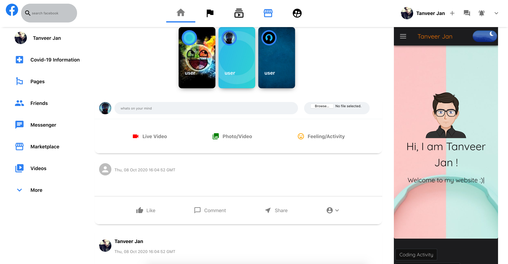

Github Repo : 

### Stack
 - ReactJS
 - NodeJS
 - MongoDB
 - ExpressJS

### Usage
The fb-backend folder should be in same location as the front-end.

#### Configurations
 - Firebase configurations should be inserted into the `firebase.js` file.
 - MongoDB Password should be inserted into `server.js` file in back-end folder.

#### Front-end

cd fb-clone
npm start


#### Back-end

nodemon server.js

